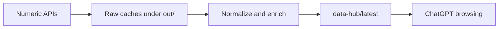

# System Design

## Mục Tiêu

Repo này là numeric data hub cho thị trường chứng khoán Việt Nam. Nó thu thập dữ liệu số, chuẩn hóa cache, tính metric cơ bản, rồi đóng gói thành artifact nhỏ để ChatGPT browser nhanh.

Không có lớp dự báo, không có report khuyến nghị, không có tin tức.

## Luồng Dữ Liệu

## API Inventory

Nguồn số đang được hỗ trợ hoặc inventory:

- VNDIRECT dchart: OHLCV daily/intraday.
- VNDIRECT priceboard: snapshot bid/ask depth.
- CafeF flows: khối ngoại và tự doanh.
- Vietstock overview: valuation snapshot.
- Vietstock BCTT: financial statement numeric tables.
- FRED/Stooq: macro market numeric series.
- Market membership sources: VN30/VN100/HOSE flags.

`data-hub/latest/api_catalog.csv` là bản catalog để ChatGPT xem nhanh source nào tạo ra loại số nào.

## Artifact Contract

`data-hub/latest/manifest.json` là điểm bắt đầu. Manifest chứa:

- timestamp tạo artifact
- danh sách ticker
- mục đích numeric-only
- thứ tự đọc file cho ChatGPT
- danh sách file có mặt
- API catalog

Output quan trọng nhất:

- `latest_metrics.csv`: một dòng mỗi ticker, ghép metric mới nhất.
- `daily/{TICKER}.csv`: daily OHLCV và technical metrics.
- `intraday/{TICKER}.csv`: intraday 1m recent rows.
- `depth/latest_depth.csv`: order book metrics nếu có cache.
- `fundamentals/vietstock_overview.csv`: valuation metrics nếu có cache.
- `flows/cafef_flows.csv`: flow metrics nếu có cache.
- `macro/latest_macro.csv`: macro latest values nếu có cache.

## Refresh Policy

`./broker.sh hub` chỉ build artifact từ cache, không tự gọi API.

`./broker.sh collect` gọi các API số được bật trong `config/data_hub.yaml`, sau đó build lại artifact. Source chậm hoặc không cần thiết có thể để `false`; khi đó data hub vẫn build từ các cache còn lại.

## Non-Goals

- Không backtest.
- Không model selection.
- Không forecast.
- Không tin tức.
- Không recommendation.
- Không portfolio/order sizing.
